# Summary
- Graph gives theory of structure i.e. what is connected to what
- Game gives theory of behavior i.e. how I reason about, what I am going to do? How it will affect you
We need to merge these two.
# Example
- 4 students
- try to give 4 door rooms 
- Different student likes different rooms
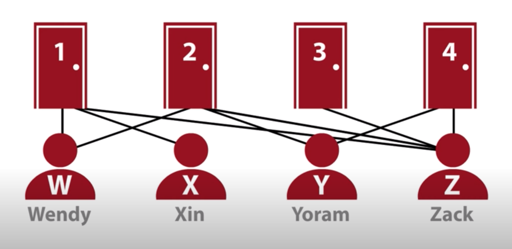
- Represent as Graph
    - Node for each room
    - Node for each student
    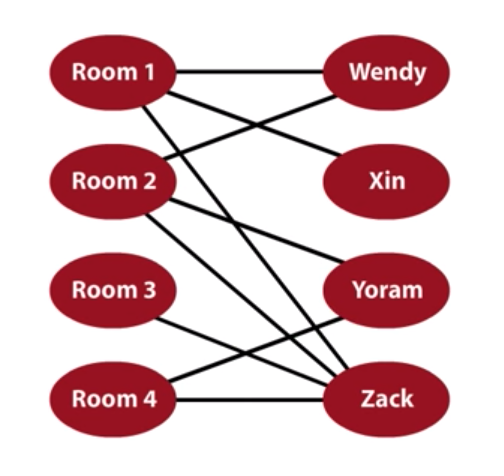
- What is goal?
    - To give each room to student as per their choice
- This graph is called bipartite graph
    - Bipartite graph is helpful to pair up things
    - For example, hospital administration trying to assign Doctor's to shift
    - Four airplane, with 4 gates. Not all airplanes fit to all gates. Need to assign gates to airplane
    - Fire crew and emergency 
- This approach is called Perfect matching
    - Not every perfect matching problem is solvable
# Unweighted bipartite Maximum Cardinality graph matching
- MCBM i.e. Maximum Cardinality Bipartite Matching
- This is when we have maximize the pairs that can be matched with each other
- Common matching variations
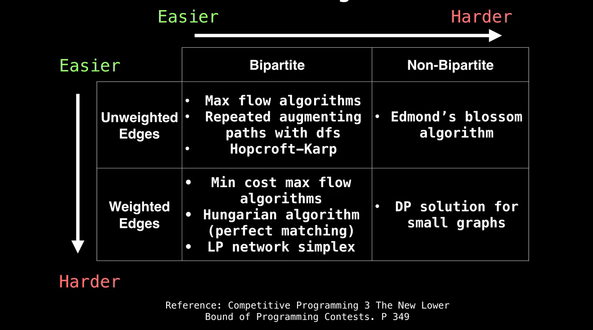
## Greedy approach
- Greedy approach doesn't find the best match
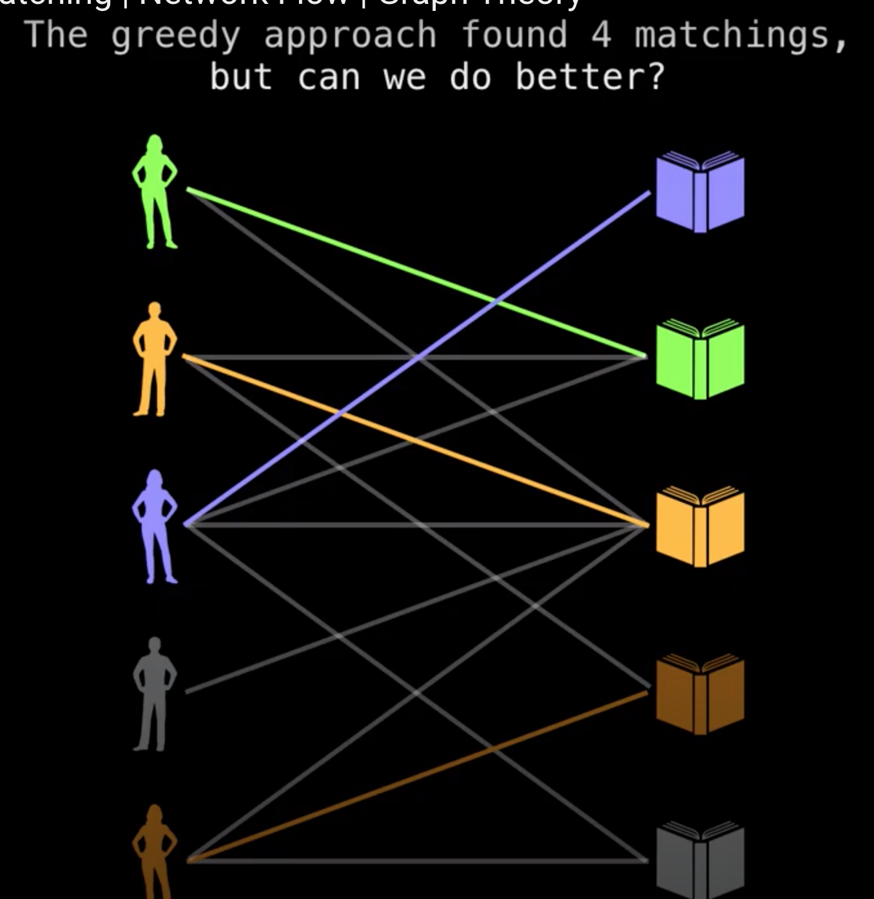
## Network flow approach
- First make edge directed
- Add unit capacity to each edge
- The 0/1 besides the edge means `0` flow and maximum capacity of `1`
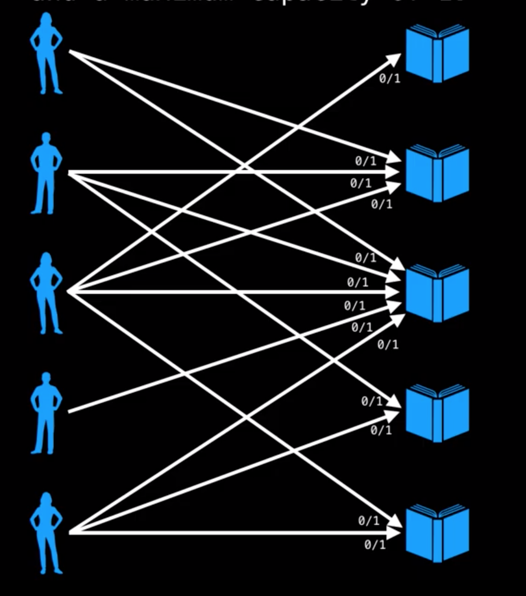
- Then attach the source `s` and sink `t` nodes allowing for `1` unit of capacity
- Use any max flow algorithm 
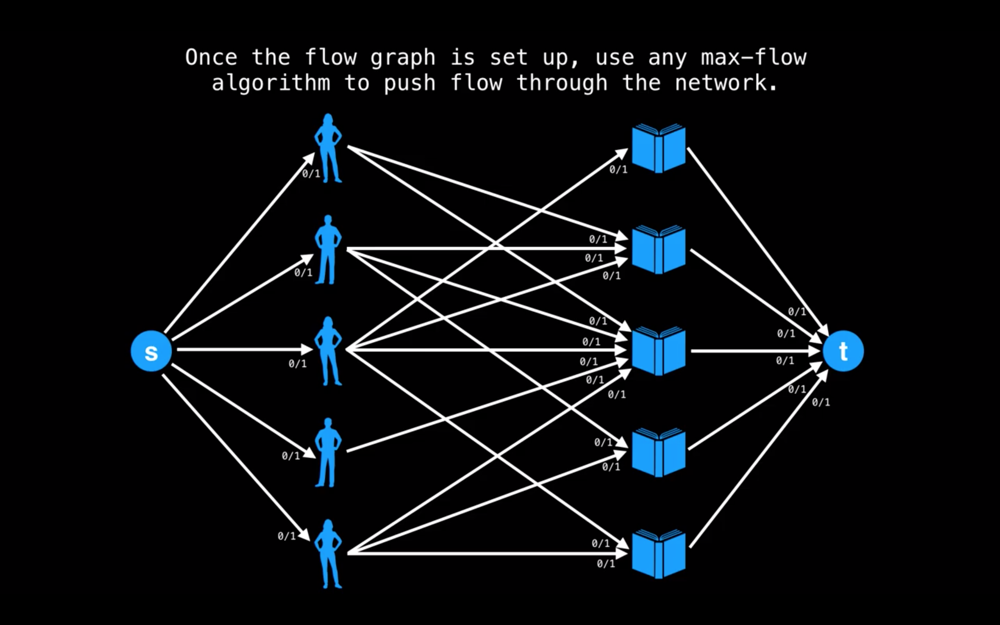
- After running max flow algo
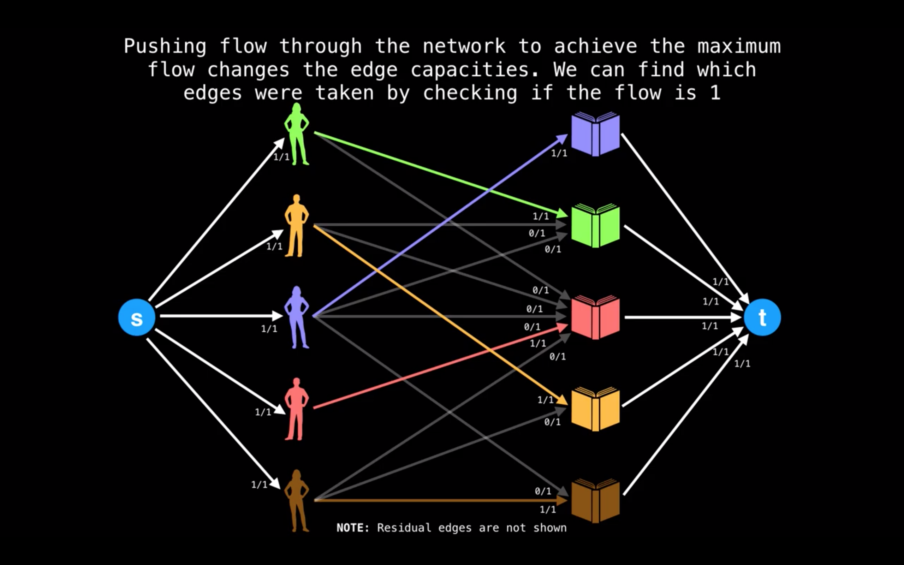
- 0/1 means, a person can get maximum of 1 book
- 0/2 means, a person can get more than one book
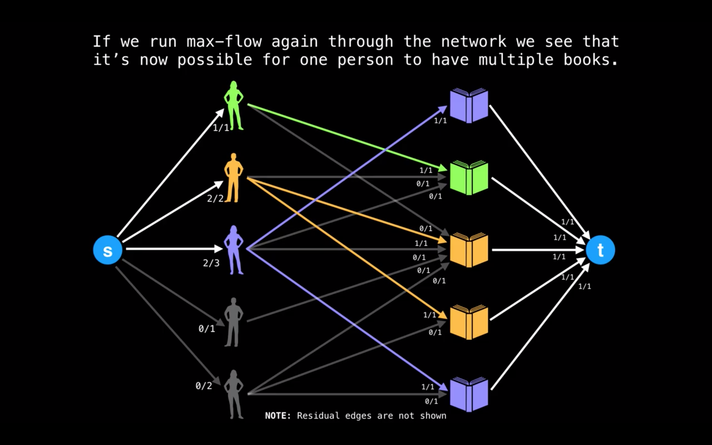
- Number of copies of books is controlled by sink
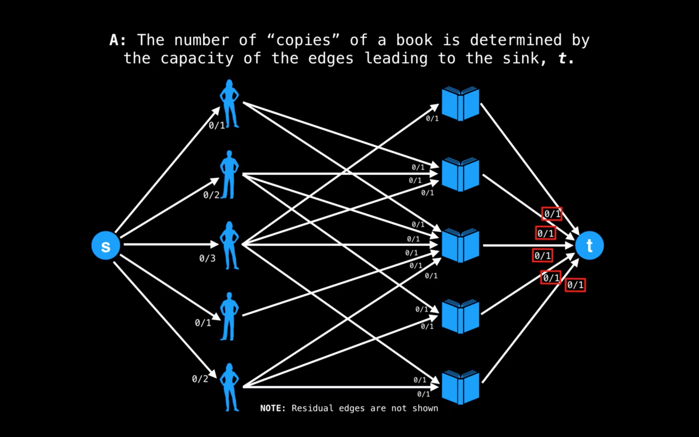
- Result of more copies of books allowed
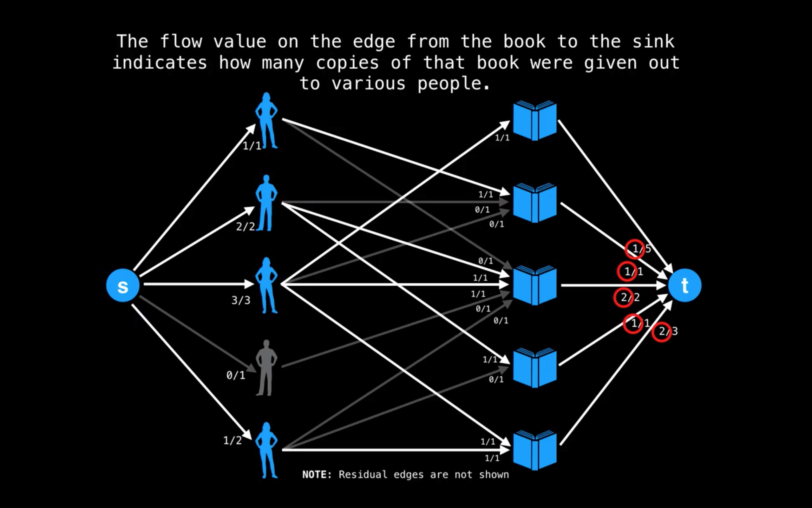
- Allow more than one copies of same book is allowed to pickup by same student
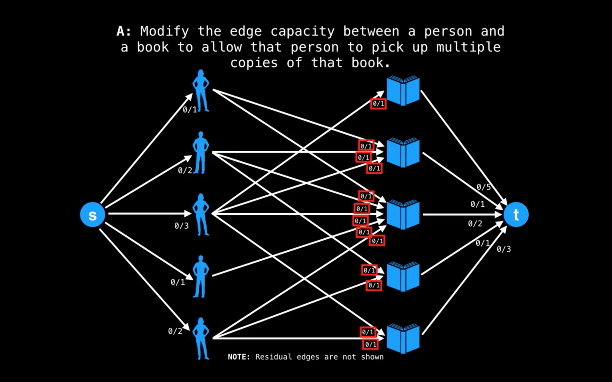

# Max flow
Q. With an infinite input source, how much `flow` can we push through the network given that each edge has a certain capacity?
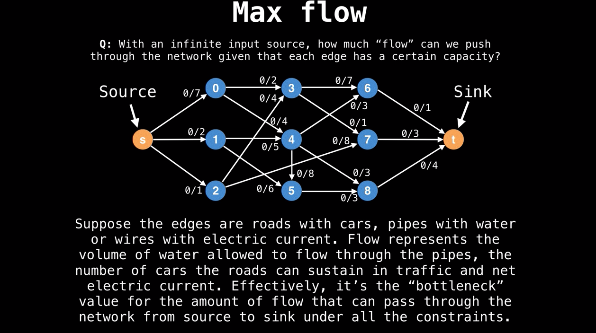
- Max flow is bottleneck value
- The amount of traffic a network can handle
- Max flow for this network is `7`
# Flow Graph
- A flow graph is a directed graph where each edge has a certain capacity which can receive a certain amount of flow.
- The flow running through edge must be less than or equal to the capacity
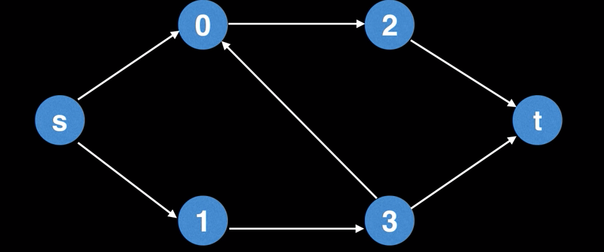
- Each edge in the flow graph has certain flow and capacity specified by the fraction adjustment to each edge.
- Initially, the flow through each node is `0` and capacity is a non negative value.
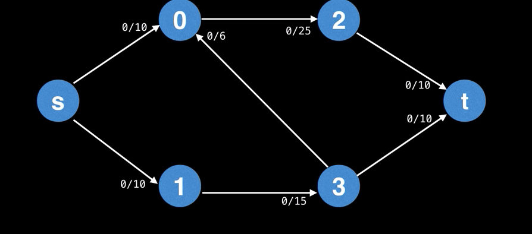
# Ford Fulkerson method to find max flow
- capacity: Total capacity of the edge. 
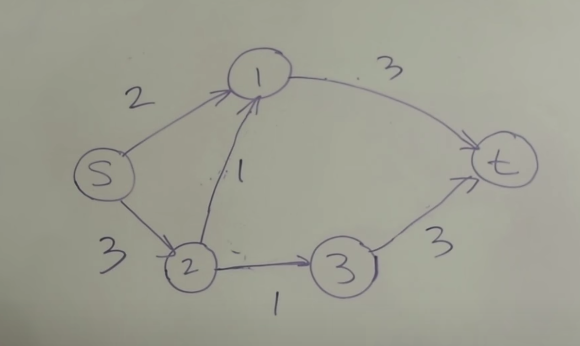
- flow: Actual units of items moving on the edge. For example, if nothing is moving so flow is `0`
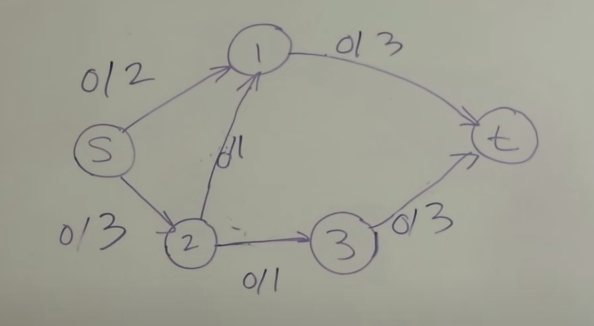
- residual capacity: Total capacity minus the flow
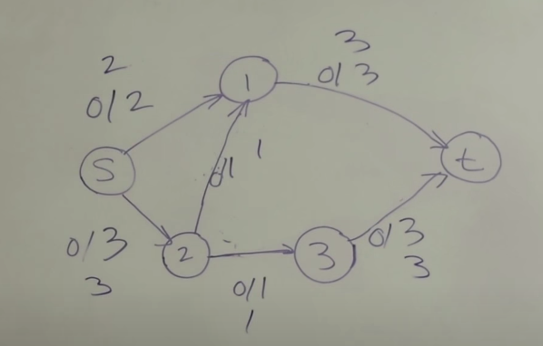
- augmented path: Is path from `s` to `t` such that the residual capacity on every edge on that path is greater than 0
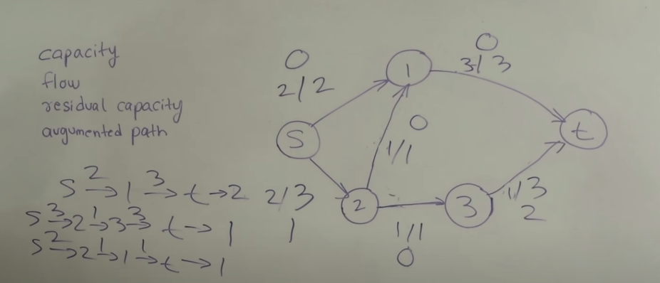
- maximum flow: Max of all augmented path
- If there is no edge between two edge then residual capacity will be `0`
- Ford fulkerson recommended to use `dfs` search
- using dfs, find the path from source to sink
    - get flow 
    - reduce existing flow/capacity
    - update reverse residual capacity
- Keep runnning dfs
# Ford Fulkerson Algorithm Edmonds Karp Algorithm For Max Flow
- use bfs
- Ford Edmonds Karp recommended to use `bfs` search
- using bfs, find the path from source to sink
    - get flow 
    - reduce existing flow/capacity
    - update reverse residual capacity
- Keep runnning bfs
# Maximal and maximum matching
- A matching of a graph G=(V,E) is a subset of edges with no common end points
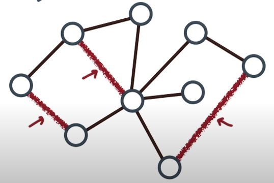
- A matching is maximal if no more edges may be added.
- A matching is maximum with largest matching
# Reference
https://www.youtube.com/watch?v=GiN3jRdgxU4
https://www.youtube.com/watch?v=LdOnanfc5TM